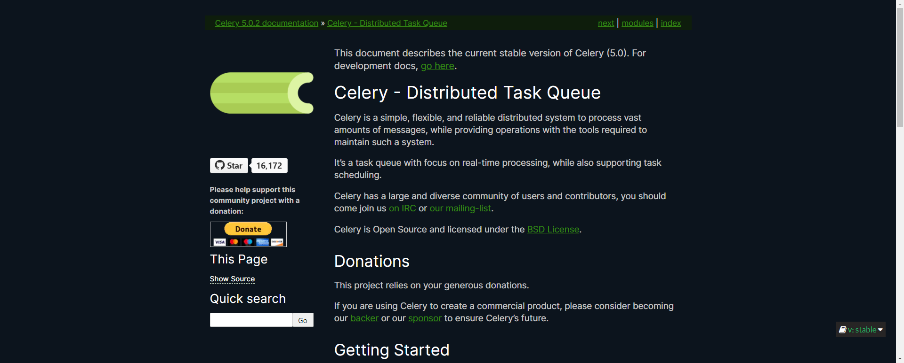
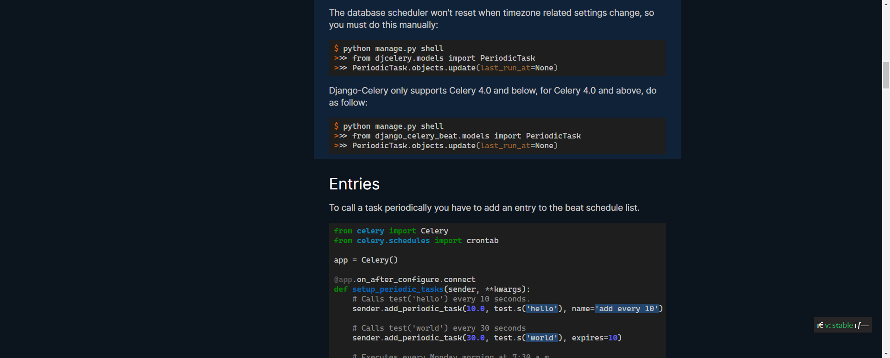
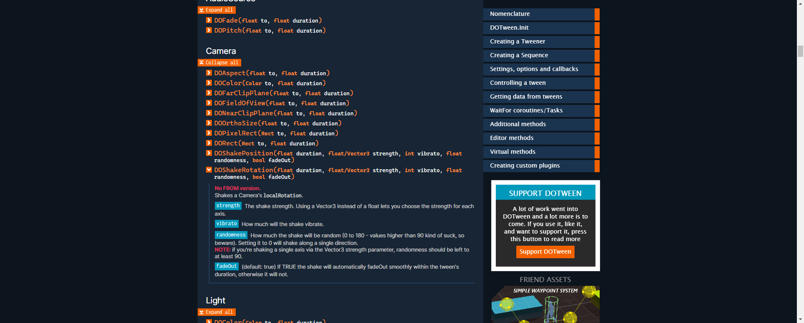

# 🎨 "Dark at dusk" themes

As I prefer to browse dark websites when I'm coding, here is a collection of personal dark themes in UserCSS format, so that you can easily install and use them with an extension like [Stylus](https://add0n.com/stylus.html).

I mainly used dark blue colors for background, a slightly grey text color (plain white has too much contrast, [Inter](https://rsms.me/inter/) as the body font and [Cascadia Code](https://github.com/microsoft/cascadia-code) as the monospace font if you have them installed.

Fonts stacks and some colors are easily customizable, using the UserCSS settings or directly the CSS variables.

Each theme is made available under the [MIT license](https://tldrlegal.com/license/mit-license).

## Django Documentation [Dark at dusk]

## Celery Documentation [Dark at dusk]

## DOTween Documentation [Dark at dusk]

